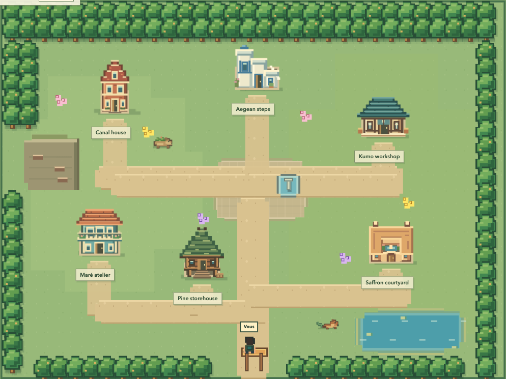

# Agent Village

Agent Village turns parallel agent work into a small village you can read in seconds.



The private native village groups actual Codex and Claude Code conversations into project buildings. It shows recent requests, timestamped reports and source history after the owner's passkey check. The public [GitHub Pages demo](https://nyrthoughts.github.io/agent-village/) uses fictional data. Activity and agent reports never prove delivery.

## Private native quick start

Requirements: Node.js 20.19+, npm and sqlite3. Run from a trusted source checkout:

```sh
npm ci
npm run build
npm run auth:setup
VILLAGE_MODE=native npm start
```

Open `http://localhost:4180`. Setup prints the location of a private `bootstrap.txt` file, never its code. Open it locally, enter the code in the locked page within 15 minutes, then register your passkey. User verification is required. Enrollment consumes the code; setup cannot replace an enrolled owner.

Conversations do not load before authentication. The browser keeps its bearer token only in memory for 30 minutes. Reloading requires another login. **Lock** removes private content immediately; successful logout revokes the server session. Each login rotates the previous session.

The server binds to `127.0.0.1` but uses `localhost` as the canonical browser origin. The IP URL redirects to localhost on the same port. Remote devices, Tailscale proxies and public tunnels are unsupported. See [owner access](docs/owner-access.md) and [deployment](docs/deployment.md) for private storage, restarts and the disposable launcher.

## Read or visit

- Read sourced project updates, a combined timeline and original conversations. Briefs extract explicit sections; they are not model-generated summaries or independently verified results.
- Click the ground to walk immediately. Click a house to open its brief immediately. No hidden visit mode or travel prerequisite. Three avatar appearances are available.
- Arrows walk, Shift+arrows pan the camera, and Escape stops walking. A new destination replaces the old one. Keyboard and touch open buildings directly, including tall roofs.
- Use bounded camera panning, mobile controls and reduced motion. Source refreshes do not reset an unchanged route.
- Choose **Français / English** before login or in the village. Interface labels and dates change; source conversations keep their original language. No translation API is used.
- Mark a project as read to identify later exchanges. Reading points and language stay in browser storage; bearer tokens and conversation text do not.

The village uses six original architectural silhouettes: Japanese workshop, Moroccan courtyard, Dutch gable, Brazilian balcony house, Greek terraces and Norwegian raised timber. A moss capybara and copper otter inhabit the gardens and water edge. Animals pause offscreen or when reduced motion is requested. No copied game assets or added game engine.

## Goals that build houses

Open a private project and choose **Define the goal**. Enter a stable objective and up to twelve milestones. Validate a milestone with a note saying what you checked. The house progresses through foundations, frame, walls and roof; reopening a milestone rolls the building back. A project without a plan displays a survey plot, never a completed house.

The panel distinguishes owner validation from a recorded local check. Neither tokens, elapsed time nor chat activity can complete a milestone. Plans live in an owner-only `project-plans.json` beside the private authentication state, outside Git and static output. Revisions prevent concurrent edits from overwriting each other. Planned projects stay visible when their recent conversations age out. Hook-only provisional identities cannot receive a permanent plan until the project is identified.

The UI shows root conversations, detected helpers, recent signals and confirmed process observations separately. A detected parent-child edge is not an active worker. At most five people are drawn per building; badges and project analytics retain the full observed counts. Tokens, worked time and remaining duration are not measured by these native connections.

## Connect existing work

Codex requires no API key. Native mode uses `sqlite3 -readonly` against its existing local index, then reads bounded transcript tails. Claude sessions come from existing journals and process metadata, including tmux when present. Nothing starts or instructs an agent.

The view refreshes every five seconds while visible. It selects up to 60 root sessions per source with a seven-day recency window; running Claude sessions may be older. Codex helpers come from at most 200 parent-child metadata records, depth eight; their transcripts are not read. Claude helper coverage includes only hooks received since startup, retained for thirty minutes. Recent means a signal within two minutes, not continuous activity. Each root transcript read is capped at 4 MiB and displayed history at 24 exchanges. Reasoning and tool payloads are excluded. Original journals remain the history source; no new conversation database is created.

Projects are grouped automatically. `VILLAGE_PROJECT_ALIASES` maps directory paths, session IDs or title prefixes to display names. `VILLAGE_FOCUS_PROJECTS` selects initially displayed project names; search still exposes the rest after login. Keep real path mappings outside the repository.

Claude and OpenClaw hooks are optional. After first-time `auth:setup`:

```sh
npm run connect:claude
# Remove only Agent Village hooks:
npm run disconnect:claude
```

The installer preserves unrelated Claude settings. Hook requests load a separate authorization header from the private `ingestion.header` file. It permits observation submissions, never project reads or owner authentication. The bundled OpenClaw plugin uses the same private header and reports lifecycle metadata only. See [connections](docs/connections.md) for installation and custom ports.

## Demo and YAML modes

```sh
npm ci
npm run dev
```

Open `http://127.0.0.1:5173` for the fictional development fixture. To serve its production build:

```sh
npm run build
npm start
```

Open `http://127.0.0.1:4180`. These demo commands do not enable native observation.

| Mode | Data and access |
| --- | --- |
| `demo` | Fictional YAML and activity fixture; default, no owner gate. |
| `truth-only` | YAML evidence without workers; no owner gate. |
| `native` | Owner passkey required; local observed projects and conversations. |
| `live` | YAML plus an AMC-compatible loopback activity endpoint; no owner gate. |

Use fictional or non-sensitive inputs outside native mode. Copy `fixtures/village.demo.yaml` to define a YAML workspace and set `VILLAGE_FILE` to its location. All IDs must be unique. Supported states are `planned`, `in_progress`, `blocked`, `awaiting_review` and `verified`.

YAML modes map `workspace → project → feature → task → subtask` into evidence-based construction stages. V1 verifies repository commit existence and approved human review. Other represented proof types (`test`, `pr_merged`, `deployed`, `observed`) remain `not_checked_v1`; they cannot prove completion. Native buildings use explicit private milestone validations instead; notes do not run tests or deployment verifiers automatically.

## Privacy boundary

The public repository and demo contain fictional data and cannot read this computer's sessions. Native source conversations stay local; authentication files must remain outside the repository and build output.

Passkeys do not protect journals against software running as the owner's OS account, root/administrator access or malware. Anyone using an unlocked browser session can read it. Do not share the OS account, passkey or active session. See [security](SECURITY.md) for the full boundary.

## Quality gates

```sh
npm run typecheck
npm test -- --run
npm run build
npm run e2e
node scripts/check-clean.mjs
npm audit
```

See [architecture](docs/architecture.md), [contributing](CONTRIBUTING.md) and [the backlog](docs/backlog.md). Agent Village has no agent control plane, remote transcript bridge or model inference service.

Apache-2.0. See `LICENSE` and `NOTICE`.
