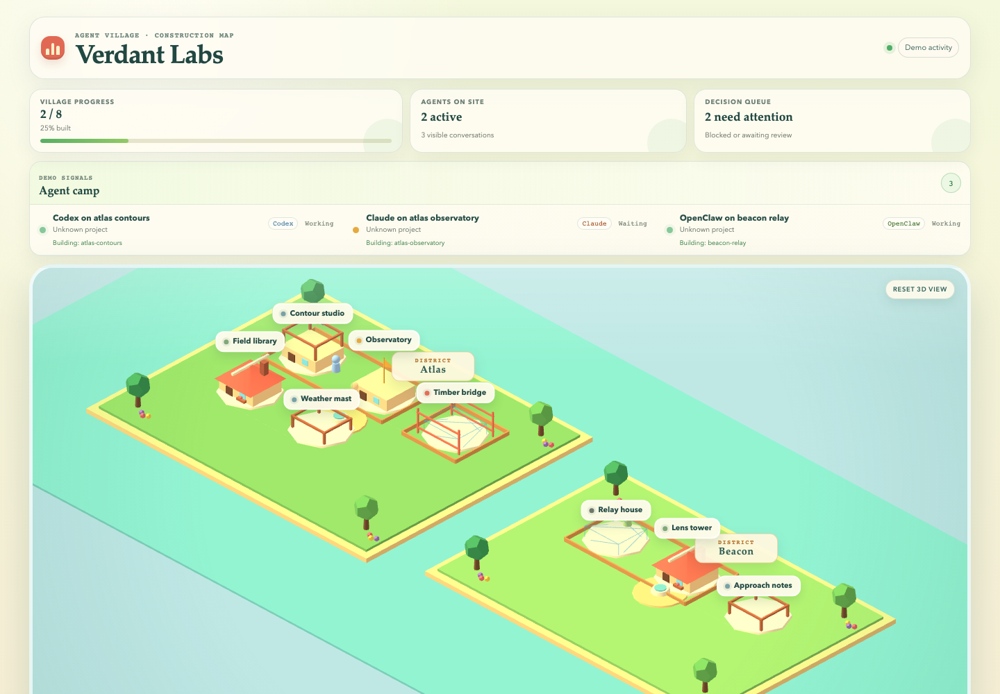

# Agent Village

Agent Village turns parallel agent work into a small construction village you can read in seconds.



In private native mode, each project has a building containing its actual Codex and Claude Code conversations, recent requests and timestamped reports. The public demo retains the evidence-backed task-building model. Activity never proves delivery.

## What V1 does

- Renders `workspace → project → feature → task → subtask` as an original top-down pixel village.
- Advances every building through lot, foundation, frame, walls, roof, and complete stages from verified work only.
- Assigns one of eight stable architectural families to each task without imported game assets.
- Keeps blocked and review markers independent from how much of a building is already constructed.
- Shows lead agents as full-sized people and helper agents as smaller people with a count above their lead.
- Opens buildings and people independently for recovery context and honest analytics.
- Shows sourced reports and history in native mode, hiding unsupported token/time estimates. The fictional demo demonstrates evidence-backed progress.
- Supports bounded panning, keyboard navigation, reduced motion, and a mobile attention list.
- Reads existing Codex Desktop/CLI and Claude Code sessions locally, including Claude tmux metadata. Optional hooks observe new lifecycle events.
- Optionally accepts redacted sessions from another local AMC-compatible endpoint.
- Keeps the last known truth visible when activity disappears.
- Publishes a safe static demo without exposing local agent data.

## Quick start

Requirements: Node.js 20.19+ and npm.

### Temporary observer launcher

Requirements: Node.js 20.19+, npm, sqlite3, curl, and tar.

```sh
curl -fsSL https://raw.githubusercontent.com/nyrthoughts/agent-village/main/scripts/run-temporary.sh | sh
```

The launcher downloads and builds Agent Village below `mktemp`, keeps its npm cache there, binds only to `127.0.0.1`, and removes the runtime when you stop it with `Ctrl-C`. It uses temporary disk and RAM while running; it does not install Agent Village, a daemon, hooks, or a database.

The local page reads private conversations on this computer, never from GitHub. Each detected project gets a building automatically. For explicit project grouping, set `VILLAGE_PROJECT_ALIASES` to a JSON object of absolute directory paths (or `session:codex:ID`, `session:claude:ID`, `title:PREFIX`) mapped to display names. Matching aliases share a building. For example:

```sh
VILLAGE_MODE=native VILLAGE_PROJECT_ALIASES='{"title:CLI":"CLI project"}' npm start
```

The public [GitHub Pages preview](https://nyrthoughts.github.io/agent-village/) always remains fictional. Inspect the [launcher source](scripts/run-temporary.sh) before running the one-line command if you prefer not to pipe remote code directly into a shell.

### Develop from source

```sh
npm ci
npm run dev
```

Open `http://127.0.0.1:5173`. The default fixture is fictional and safe to publish.

To run the production build locally:

```sh
npm run build
npm start
```

Open `http://127.0.0.1:4180`.

Drag the map or use the arrow keys to explore it. Select a house or person to open its field record.

## Connect your work

Copy `fixtures/village.demo.yaml`, replace the fictional content, and point the server at it:

```sh
VILLAGE_FILE=/absolute/path/to/village.yaml VILLAGE_MODE=truth-only npm start
```

The hierarchy is intentionally small:

```yaml
version: 1
name: My workspace
projects:
  - id: product
    name: Product
    objective: Ship the first useful release
    features:
      - id: onboarding
        title: Onboarding
        tasks:
          - id: signup
            title: Signup flow
            owner: codex
            status: in_progress
            nextAction: Verify the happy path
            resumeHint: codex resume signup
            subtasks: []
            evidence: []
    tasks: []
```

Every ID must be unique. Supported states are `planned`, `in_progress`, `blocked`, `awaiting_review`, and `verified`.

## Evidence, not vibes

V1 inspects two proof types:

- `commit`: verifies that a 7–40 character lowercase SHA exists inside a repository below the YAML directory.
- `human_review`: `approved` proves completion; `pending` moves the item to review.

`test`, `pr_merged`, `deployed`, and `observed` are represented but return `not_checked_v1`. They cannot prove completion yet. A declared `verified` item without verified evidence is downgraded to `in_progress` with `unproven_claim`.

## Activity modes

| Mode | Behavior |
| --- | --- |
| `demo` | Uses the fictional activity fixture. This is the default. |
| `truth-only` | Shows no workers. Progress still works completely. |
| `native` | Reads local Codex/Claude transcripts and shows project buildings, reports and history. |
| `live` | Reads a local AMC-compatible JSON endpoint with an 800 ms timeout. |

### Native Codex + Claude Code

Codex needs no API key. The observer uses `sqlite3 -readonly` against `~/.codex/state_5.sqlite`, then reads bounded transcript tails. Claude sessions are discovered from `~/.claude/projects` and running-process metadata in `~/.claude/sessions`. Existing tmux sessions appear without restarting their agents. Sources are limited to this computer; a remote CLI is not implicitly connected.

The private view includes user requests and assistant reports, but excludes reasoning and tool payloads. It refreshes every five seconds while visible. History survives dashboard restarts by rereading the original journals, not by creating another conversation database. Limits: 60 recent sessions per source, seven days, a 4 MiB transcript tail and 24 exchanges per session. Unsupported metrics are omitted. Reports are agent claims, not independently verified outcomes. Native requests reject foreign hosts/origins; the server binds to loopback only. Do not expose it through a public tunnel.

Choose **Français / English** in the native view header. The browser remembers the choice. Interface labels, dates and known system messages switch language; project names and original conversation excerpts remain unchanged. No translation API is used.

**Local-only is not user authentication.** There is no login in native mode. Other software or accounts on the same computer, or someone using your browser session, may access the local endpoint. The public GitHub repository and GitHub Pages demo are accessible to everyone; they contain fictional data, not your native conversations. An Internet-hosted personal dashboard would require a separate authenticated deployment.

Each project opens a sourced **brief**, a combined **evolution timeline**, and its **conversations**. Explicit done/next/blocker sections are extracted verbatim from the latest reports, not inferred by a model. Mark a project as read to see new exchanges on your next visit; this reading point stays in browser storage. Set `VILLAGE_FOCUS_PROJECTS='["Product","Data"]'` to show a focused set of project buildings by default; search and “other projects” still expose the rest. Focused projects retain distinct architectural styles when filtered.

Start the dashboard; hooks are optional for additional lifecycle events:

```sh
npm run build
VILLAGE_MODE=native npm start
# Optional: npm run connect:claude
```

The installer preserves existing Claude settings and is idempotent. It observes `SubagentStart` and `SubagentStop` so helpers remain attached to their lead. Remove only Agent Village's hooks with `npm run disconnect:claude`.

### OpenClaw

Install the bundled local plugin on a machine with OpenClaw:

```sh
openclaw plugins install ./integrations/openclaw
VILLAGE_MODE=native npm start
```

The plugin sends lifecycle metadata only. OpenClaw is optional and is not a runtime dependency of Agent Village.

For live mode:

```sh
VILLAGE_MODE=live AMC_ENDPOINT=http://127.0.0.1:PORT/api/dashboard npm start
```

The adapter accepts only loopback HTTP endpoints, allowlists fields, normalizes tools/states, redacts likely paths, emails, and secrets, and never mutates progress. Map session titles to tasks with `activity_mapping` in the YAML fixture.

## Quality gates

```sh
npm run typecheck
npm test -- --run
npm run build
npm run e2e
node scripts/check-clean.mjs
npm audit
```

See [connections](docs/connections.md), [architecture](docs/architecture.md), [private deployment](docs/deployment.md), [contributing](CONTRIBUTING.md), and [security](SECURITY.md).

## V1 boundaries

No database, game engine, copied game asset, WebSocket layer, authentication system, or agent control plane. Public hosting serves the fictional demo only; real agent activity stays on the local machine. React, CSS pixel art, and YAML are enough for the first release. See [the backlog](docs/backlog.md) for deliberately deferred work.

Apache-2.0. See `LICENSE` and `NOTICE`.
